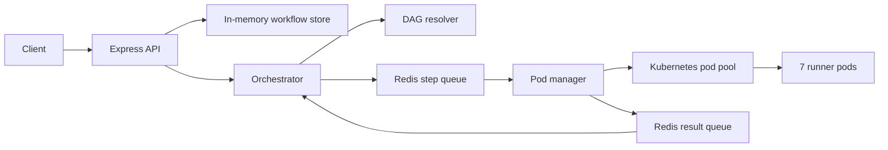

# Prerequisites

- Docker
- kind
- kubectl
- Bun
- Redis running locally (`docker run -p 6379:6379 redis`)

# Setup

```bash
# 1. Start Redis
docker run -d -p 6379:6379 redis

# 2. Spin up kind cluster and runner pods
chmod +x k8s/setup.sh
./k8s/setup.sh

# 3. Install dependencies
bun install

# 4. Start the server
bun run dev
```

# Verify pods are running

```bash
kubectl get pods -n workflow-runner
```

# Test the API

```bash
# Submit a workflow
curl -X POST http://localhost:3000/workflow \
  -H "Content-Type: application/json" \
  -d '{
    "workflowId": "wf-123",
    "steps": [
      { "id": "A", "command": "echo hello" },
      { "id": "B", "command": "ls /",   "dependsOn": ["A"] },
      { "id": "C", "command": "pwd",    "dependsOn": ["A"] },
      { "id": "D", "command": "date",   "dependsOn": ["B", "C"] }
    ]
  }'

# Check status
curl http://localhost:3000/workflow/wf-123

# Check pod pool
curl http://localhost:3000/pods
```

# Architecture


