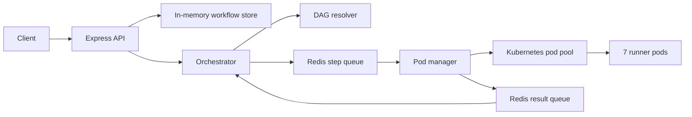

# Mini Workflow Orchestration Boilerplate

This is the starter project for the workflow orchestration assignment. The Kubernetes, Redis client, queue plumbing, workflow store, and shared types are provided. Students implement the orchestration logic in the TODO files.

## Prerequisites

- Docker
- kind
- kubectl
- Bun
- Redis running locally (`docker run -p 6379:6379 redis`)

## Setup

```bash
# 1. Install dependencies
bun install

# 2. Start Redis
docker run -d --name workflow-redis -p 6379:6379 redis

# If that container name already exists, start it instead:
docker start workflow-redis

# 3. Spin up the kind cluster and 7 runner pods
chmod +x k8s/setup.sh
./k8s/setup.sh

# 4. Start the server
bun run dev
```

## Verify Kubernetes

```bash
kubectl get pods -n workflow-runner
```

Expected: `runner-0` through `runner-6` should be `Running`.

## Test the Boilerplate

Check the pod pool. This route works before students implement the assignment:

```bash
curl http://localhost:3000/pods
```

Expected:

```json
{"total":7,"available":7,"leased":[]}
```

Submit a workflow:

```bash
curl -X POST http://localhost:3000/workflow \
  -H "Content-Type: application/json" \
  -d '{
    "workflowId": "wf-123",
    "steps": [
      { "id": "A", "command": "echo hello" },
      { "id": "B", "command": "ls /",   "dependsOn": ["A"] },
      { "id": "C", "command": "pwd",    "dependsOn": ["A"] },
      { "id": "D", "command": "date",   "dependsOn": ["B", "C"] }
    ]
  }'
```

In the starter boilerplate, this returns:

```json
{"error":"Not implemented"}
```

That is expected. Students wire this route to `orchestrator.submitWorkflow()` in Section 1.

After implementing Section 1, check workflow status:

```bash
curl http://localhost:3000/workflow/wf-123
```

## Useful Commands

Stop the local server if port `3000` is busy:

```bash
lsof -ti:3000 | xargs kill -9 2>/dev/null || true
```

Restart Redis:

```bash
docker restart workflow-redis
```

Delete and recreate the kind cluster:

```bash
kind delete cluster --name workflow-cluster
./k8s/setup.sh
```

## Architecture


